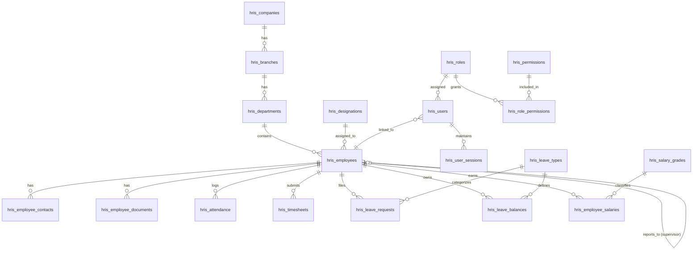
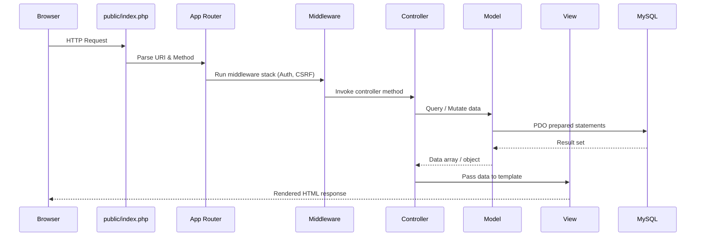

# HRIS v1 — Comprehensive Implementation Plan

> A custom Human Resources Information System inspired by IceHRM, OrangeHRM, and PHPHR.  
> **Stack:** HTML · CSS · JavaScript · PHP (MVC) · MySQL

---

## Phase 1: Core Modules & Database Schema

### 1.1 Core Modules Identified

| # | Module | Purpose |
|---|--------|---------|
| 1 | **Authentication & RBAC** | Secure login, sessions, role-based access control |
| 2 | **Company Structure** | Organizations, branches, departments, designations |
| 3 | **Employee Information (PIM)** | Master employee records, contacts, documents |
| 4 | **Time & Attendance** | Clock-in/out, timesheets, overtime tracking |
| 5 | **Leave Management** | Leave types, balances, requests, approvals |
| 6 | **Payroll Foundation** | Salary grades, allowances, deductions (structure only) |
| 7 | **Dashboard & Reporting** | KPI widgets, quick stats, announcements |

### 1.2 MySQL Database Schema

> All tables use `InnoDB` engine for foreign key support. Charset: `utf8mb4_unicode_ci`.  
> Naming convention: `snake_case`, prefixed with `hris_`.

---

#### 1.2.1 Authentication & RBAC

```sql
-- ============================================================
-- ROLES & PERMISSIONS
-- ============================================================
CREATE TABLE hris_roles (
    id          INT UNSIGNED AUTO_INCREMENT PRIMARY KEY,
    role_name   VARCHAR(50) NOT NULL UNIQUE,
    description VARCHAR(255) DEFAULT NULL,
    is_active   TINYINT(1) NOT NULL DEFAULT 1,
    created_at  TIMESTAMP DEFAULT CURRENT_TIMESTAMP,
    updated_at  TIMESTAMP DEFAULT CURRENT_TIMESTAMP ON UPDATE CURRENT_TIMESTAMP
) ENGINE=InnoDB DEFAULT CHARSET=utf8mb4 COLLATE=utf8mb4_unicode_ci;

CREATE TABLE hris_permissions (
    id              INT UNSIGNED AUTO_INCREMENT PRIMARY KEY,
    permission_key  VARCHAR(100) NOT NULL UNIQUE,  -- e.g. 'employees.view', 'leave.approve'
    module          VARCHAR(50) NOT NULL,
    description     VARCHAR(255) DEFAULT NULL,
    created_at      TIMESTAMP DEFAULT CURRENT_TIMESTAMP
) ENGINE=InnoDB DEFAULT CHARSET=utf8mb4 COLLATE=utf8mb4_unicode_ci;

CREATE TABLE hris_role_permissions (
    role_id       INT UNSIGNED NOT NULL,
    permission_id INT UNSIGNED NOT NULL,
    PRIMARY KEY (role_id, permission_id),
    FOREIGN KEY (role_id) REFERENCES hris_roles(id) ON DELETE CASCADE,
    FOREIGN KEY (permission_id) REFERENCES hris_permissions(id) ON DELETE CASCADE
) ENGINE=InnoDB DEFAULT CHARSET=utf8mb4 COLLATE=utf8mb4_unicode_ci;

-- ============================================================
-- USERS (login accounts — separated from employee records)
-- ============================================================
CREATE TABLE hris_users (
    id              INT UNSIGNED AUTO_INCREMENT PRIMARY KEY,
    username        VARCHAR(50) NOT NULL UNIQUE,
    email           VARCHAR(150) NOT NULL UNIQUE,
    password_hash   VARCHAR(255) NOT NULL,
    role_id         INT UNSIGNED NOT NULL,
    employee_id     INT UNSIGNED DEFAULT NULL,      -- linked after employee record created
    is_active       TINYINT(1) NOT NULL DEFAULT 1,
    last_login      DATETIME DEFAULT NULL,
    failed_attempts TINYINT UNSIGNED DEFAULT 0,
    locked_until    DATETIME DEFAULT NULL,
    created_at      TIMESTAMP DEFAULT CURRENT_TIMESTAMP,
    updated_at      TIMESTAMP DEFAULT CURRENT_TIMESTAMP ON UPDATE CURRENT_TIMESTAMP,
    FOREIGN KEY (role_id) REFERENCES hris_roles(id) ON DELETE RESTRICT,
    INDEX idx_users_email (email),
    INDEX idx_users_employee (employee_id)
) ENGINE=InnoDB DEFAULT CHARSET=utf8mb4 COLLATE=utf8mb4_unicode_ci;

CREATE TABLE hris_user_sessions (
    id          VARCHAR(128) PRIMARY KEY,
    user_id     INT UNSIGNED NOT NULL,
    ip_address  VARCHAR(45) NOT NULL,
    user_agent  VARCHAR(255) DEFAULT NULL,
    payload     TEXT,
    last_activity TIMESTAMP DEFAULT CURRENT_TIMESTAMP ON UPDATE CURRENT_TIMESTAMP,
    FOREIGN KEY (user_id) REFERENCES hris_users(id) ON DELETE CASCADE,
    INDEX idx_sessions_user (user_id)
) ENGINE=InnoDB DEFAULT CHARSET=utf8mb4 COLLATE=utf8mb4_unicode_ci;
```

---

#### 1.2.2 Company Structure

```sql
CREATE TABLE hris_companies (
    id           INT UNSIGNED AUTO_INCREMENT PRIMARY KEY,
    company_name VARCHAR(150) NOT NULL,
    address      TEXT,
    phone        VARCHAR(30) DEFAULT NULL,
    email        VARCHAR(150) DEFAULT NULL,
    website      VARCHAR(255) DEFAULT NULL,
    logo_path    VARCHAR(255) DEFAULT NULL,
    created_at   TIMESTAMP DEFAULT CURRENT_TIMESTAMP,
    updated_at   TIMESTAMP DEFAULT CURRENT_TIMESTAMP ON UPDATE CURRENT_TIMESTAMP
) ENGINE=InnoDB DEFAULT CHARSET=utf8mb4 COLLATE=utf8mb4_unicode_ci;

CREATE TABLE hris_branches (
    id          INT UNSIGNED AUTO_INCREMENT PRIMARY KEY,
    company_id  INT UNSIGNED NOT NULL,
    branch_name VARCHAR(100) NOT NULL,
    address     TEXT,
    phone       VARCHAR(30) DEFAULT NULL,
    is_active   TINYINT(1) NOT NULL DEFAULT 1,
    created_at  TIMESTAMP DEFAULT CURRENT_TIMESTAMP,
    updated_at  TIMESTAMP DEFAULT CURRENT_TIMESTAMP ON UPDATE CURRENT_TIMESTAMP,
    FOREIGN KEY (company_id) REFERENCES hris_companies(id) ON DELETE CASCADE,
    INDEX idx_branch_company (company_id)
) ENGINE=InnoDB DEFAULT CHARSET=utf8mb4 COLLATE=utf8mb4_unicode_ci;

CREATE TABLE hris_departments (
    id              INT UNSIGNED AUTO_INCREMENT PRIMARY KEY,
    branch_id       INT UNSIGNED NOT NULL,
    department_name VARCHAR(100) NOT NULL,
    head_employee_id INT UNSIGNED DEFAULT NULL,     -- FK added after employees table
    is_active       TINYINT(1) NOT NULL DEFAULT 1,
    created_at      TIMESTAMP DEFAULT CURRENT_TIMESTAMP,
    updated_at      TIMESTAMP DEFAULT CURRENT_TIMESTAMP ON UPDATE CURRENT_TIMESTAMP,
    FOREIGN KEY (branch_id) REFERENCES hris_branches(id) ON DELETE CASCADE,
    INDEX idx_dept_branch (branch_id)
) ENGINE=InnoDB DEFAULT CHARSET=utf8mb4 COLLATE=utf8mb4_unicode_ci;

CREATE TABLE hris_designations (
    id               INT UNSIGNED AUTO_INCREMENT PRIMARY KEY,
    designation_name VARCHAR(100) NOT NULL,
    description      VARCHAR(255) DEFAULT NULL,
    created_at       TIMESTAMP DEFAULT CURRENT_TIMESTAMP
) ENGINE=InnoDB DEFAULT CHARSET=utf8mb4 COLLATE=utf8mb4_unicode_ci;
```

---

#### 1.2.3 Employee Information Management (PIM)

```sql
CREATE TABLE hris_employees (
    id               INT UNSIGNED AUTO_INCREMENT PRIMARY KEY,
    employee_code    VARCHAR(20) NOT NULL UNIQUE,    -- e.g. EMP-0001
    first_name       VARCHAR(80) NOT NULL,
    middle_name      VARCHAR(80) DEFAULT NULL,
    last_name        VARCHAR(80) NOT NULL,
    gender           ENUM('Male','Female','Other') NOT NULL,
    date_of_birth    DATE NOT NULL,
    marital_status   ENUM('Single','Married','Divorced','Widowed') DEFAULT 'Single',
    nationality      VARCHAR(60) DEFAULT NULL,
    phone            VARCHAR(30) DEFAULT NULL,
    email            VARCHAR(150) DEFAULT NULL,
    address          TEXT,
    photo_path       VARCHAR(255) DEFAULT NULL,

    -- Employment details
    department_id    INT UNSIGNED NOT NULL,
    designation_id   INT UNSIGNED NOT NULL,
    employment_type  ENUM('Full-Time','Part-Time','Contract','Intern') DEFAULT 'Full-Time',
    employment_status ENUM('Active','Probation','On Leave','Resigned','Terminated') DEFAULT 'Active',
    date_hired       DATE NOT NULL,
    date_regularized DATE DEFAULT NULL,
    date_separated   DATE DEFAULT NULL,

    -- Supervisor hierarchy
    supervisor_id    INT UNSIGNED DEFAULT NULL,

    created_at       TIMESTAMP DEFAULT CURRENT_TIMESTAMP,
    updated_at       TIMESTAMP DEFAULT CURRENT_TIMESTAMP ON UPDATE CURRENT_TIMESTAMP,

    FOREIGN KEY (department_id) REFERENCES hris_departments(id) ON DELETE RESTRICT,
    FOREIGN KEY (designation_id) REFERENCES hris_designations(id) ON DELETE RESTRICT,
    FOREIGN KEY (supervisor_id) REFERENCES hris_employees(id) ON DELETE SET NULL,

    INDEX idx_emp_dept (department_id),
    INDEX idx_emp_status (employment_status),
    INDEX idx_emp_supervisor (supervisor_id)
) ENGINE=InnoDB DEFAULT CHARSET=utf8mb4 COLLATE=utf8mb4_unicode_ci;

-- Back-reference: link departments.head_employee_id → employees
ALTER TABLE hris_departments
    ADD FOREIGN KEY (head_employee_id) REFERENCES hris_employees(id) ON DELETE SET NULL;

-- Back-reference: link users.employee_id → employees
ALTER TABLE hris_users
    ADD FOREIGN KEY (employee_id) REFERENCES hris_employees(id) ON DELETE SET NULL;

-- Emergency contacts
CREATE TABLE hris_employee_contacts (
    id            INT UNSIGNED AUTO_INCREMENT PRIMARY KEY,
    employee_id   INT UNSIGNED NOT NULL,
    contact_name  VARCHAR(100) NOT NULL,
    relationship  VARCHAR(50) NOT NULL,
    phone         VARCHAR(30) NOT NULL,
    address       TEXT DEFAULT NULL,
    is_primary    TINYINT(1) DEFAULT 0,
    FOREIGN KEY (employee_id) REFERENCES hris_employees(id) ON DELETE CASCADE
) ENGINE=InnoDB DEFAULT CHARSET=utf8mb4 COLLATE=utf8mb4_unicode_ci;

-- Employee documents (contracts, IDs, etc.)
CREATE TABLE hris_employee_documents (
    id            INT UNSIGNED AUTO_INCREMENT PRIMARY KEY,
    employee_id   INT UNSIGNED NOT NULL,
    document_type VARCHAR(50) NOT NULL,             -- 'Contract', 'ID', 'Certificate'
    document_name VARCHAR(150) NOT NULL,
    file_path     VARCHAR(255) NOT NULL,
    expiry_date   DATE DEFAULT NULL,
    uploaded_at   TIMESTAMP DEFAULT CURRENT_TIMESTAMP,
    FOREIGN KEY (employee_id) REFERENCES hris_employees(id) ON DELETE CASCADE
) ENGINE=InnoDB DEFAULT CHARSET=utf8mb4 COLLATE=utf8mb4_unicode_ci;
```

---

#### 1.2.4 Time & Attendance

```sql
CREATE TABLE hris_attendance (
    id           INT UNSIGNED AUTO_INCREMENT PRIMARY KEY,
    employee_id  INT UNSIGNED NOT NULL,
    date         DATE NOT NULL,
    clock_in     DATETIME DEFAULT NULL,
    clock_out    DATETIME DEFAULT NULL,
    hours_worked DECIMAL(5,2) DEFAULT NULL,          -- computed or manual
    overtime_hrs DECIMAL(5,2) DEFAULT 0,
    status       ENUM('Present','Absent','Late','Half-Day','Holiday','Rest Day') DEFAULT 'Present',
    remarks      VARCHAR(255) DEFAULT NULL,
    created_at   TIMESTAMP DEFAULT CURRENT_TIMESTAMP,

    FOREIGN KEY (employee_id) REFERENCES hris_employees(id) ON DELETE CASCADE,
    UNIQUE KEY uq_attendance (employee_id, date),
    INDEX idx_att_date (date)
) ENGINE=InnoDB DEFAULT CHARSET=utf8mb4 COLLATE=utf8mb4_unicode_ci;

CREATE TABLE hris_timesheets (
    id           INT UNSIGNED AUTO_INCREMENT PRIMARY KEY,
    employee_id  INT UNSIGNED NOT NULL,
    period_start DATE NOT NULL,
    period_end   DATE NOT NULL,
    total_hours  DECIMAL(6,2) DEFAULT 0,
    total_ot     DECIMAL(6,2) DEFAULT 0,
    status       ENUM('Draft','Submitted','Approved','Rejected') DEFAULT 'Draft',
    approved_by  INT UNSIGNED DEFAULT NULL,
    approved_at  DATETIME DEFAULT NULL,
    created_at   TIMESTAMP DEFAULT CURRENT_TIMESTAMP,

    FOREIGN KEY (employee_id) REFERENCES hris_employees(id) ON DELETE CASCADE,
    FOREIGN KEY (approved_by) REFERENCES hris_users(id) ON DELETE SET NULL
) ENGINE=InnoDB DEFAULT CHARSET=utf8mb4 COLLATE=utf8mb4_unicode_ci;
```

---

#### 1.2.5 Leave Management

```sql
CREATE TABLE hris_leave_types (
    id                 INT UNSIGNED AUTO_INCREMENT PRIMARY KEY,
    type_name          VARCHAR(60) NOT NULL UNIQUE,  -- 'Vacation', 'Sick', 'Maternity'
    description        VARCHAR(255) DEFAULT NULL,
    default_days       DECIMAL(4,1) NOT NULL DEFAULT 0,
    is_paid            TINYINT(1) DEFAULT 1,
    is_active          TINYINT(1) DEFAULT 1,
    created_at         TIMESTAMP DEFAULT CURRENT_TIMESTAMP
) ENGINE=InnoDB DEFAULT CHARSET=utf8mb4 COLLATE=utf8mb4_unicode_ci;

CREATE TABLE hris_leave_balances (
    id            INT UNSIGNED AUTO_INCREMENT PRIMARY KEY,
    employee_id   INT UNSIGNED NOT NULL,
    leave_type_id INT UNSIGNED NOT NULL,
    year          YEAR NOT NULL,
    total_days    DECIMAL(4,1) NOT NULL DEFAULT 0,
    used_days     DECIMAL(4,1) NOT NULL DEFAULT 0,
    remaining_days DECIMAL(4,1) GENERATED ALWAYS AS (total_days - used_days) STORED,

    FOREIGN KEY (employee_id) REFERENCES hris_employees(id) ON DELETE CASCADE,
    FOREIGN KEY (leave_type_id) REFERENCES hris_leave_types(id) ON DELETE CASCADE,
    UNIQUE KEY uq_leave_bal (employee_id, leave_type_id, year)
) ENGINE=InnoDB DEFAULT CHARSET=utf8mb4 COLLATE=utf8mb4_unicode_ci;

CREATE TABLE hris_leave_requests (
    id             INT UNSIGNED AUTO_INCREMENT PRIMARY KEY,
    employee_id    INT UNSIGNED NOT NULL,
    leave_type_id  INT UNSIGNED NOT NULL,
    start_date     DATE NOT NULL,
    end_date       DATE NOT NULL,
    total_days     DECIMAL(4,1) NOT NULL,
    reason         TEXT DEFAULT NULL,
    status         ENUM('Pending','Approved','Rejected','Cancelled') DEFAULT 'Pending',
    reviewed_by    INT UNSIGNED DEFAULT NULL,
    reviewed_at    DATETIME DEFAULT NULL,
    review_remarks VARCHAR(255) DEFAULT NULL,
    created_at     TIMESTAMP DEFAULT CURRENT_TIMESTAMP,
    updated_at     TIMESTAMP DEFAULT CURRENT_TIMESTAMP ON UPDATE CURRENT_TIMESTAMP,

    FOREIGN KEY (employee_id) REFERENCES hris_employees(id) ON DELETE CASCADE,
    FOREIGN KEY (leave_type_id) REFERENCES hris_leave_types(id) ON DELETE RESTRICT,
    FOREIGN KEY (reviewed_by) REFERENCES hris_users(id) ON DELETE SET NULL,
    INDEX idx_leave_emp (employee_id),
    INDEX idx_leave_status (status),
    INDEX idx_leave_dates (start_date, end_date)
) ENGINE=InnoDB DEFAULT CHARSET=utf8mb4 COLLATE=utf8mb4_unicode_ci;
```

---

#### 1.2.6 Payroll Foundation

```sql
CREATE TABLE hris_salary_grades (
    id         INT UNSIGNED AUTO_INCREMENT PRIMARY KEY,
    grade_name VARCHAR(50) NOT NULL UNIQUE,
    min_salary DECIMAL(12,2) NOT NULL,
    max_salary DECIMAL(12,2) NOT NULL,
    created_at TIMESTAMP DEFAULT CURRENT_TIMESTAMP
) ENGINE=InnoDB DEFAULT CHARSET=utf8mb4 COLLATE=utf8mb4_unicode_ci;

CREATE TABLE hris_employee_salaries (
    id             INT UNSIGNED AUTO_INCREMENT PRIMARY KEY,
    employee_id    INT UNSIGNED NOT NULL,
    salary_grade_id INT UNSIGNED DEFAULT NULL,
    basic_salary   DECIMAL(12,2) NOT NULL,
    effective_date DATE NOT NULL,
    is_current     TINYINT(1) DEFAULT 1,
    created_at     TIMESTAMP DEFAULT CURRENT_TIMESTAMP,

    FOREIGN KEY (employee_id) REFERENCES hris_employees(id) ON DELETE CASCADE,
    FOREIGN KEY (salary_grade_id) REFERENCES hris_salary_grades(id) ON DELETE SET NULL,
    INDEX idx_sal_emp (employee_id)
) ENGINE=InnoDB DEFAULT CHARSET=utf8mb4 COLLATE=utf8mb4_unicode_ci;

CREATE TABLE hris_allowances (
    id             INT UNSIGNED AUTO_INCREMENT PRIMARY KEY,
    allowance_name VARCHAR(80) NOT NULL,
    description    VARCHAR(255) DEFAULT NULL,
    is_taxable     TINYINT(1) DEFAULT 0,
    created_at     TIMESTAMP DEFAULT CURRENT_TIMESTAMP
) ENGINE=InnoDB DEFAULT CHARSET=utf8mb4 COLLATE=utf8mb4_unicode_ci;

CREATE TABLE hris_deductions (
    id             INT UNSIGNED AUTO_INCREMENT PRIMARY KEY,
    deduction_name VARCHAR(80) NOT NULL,
    description    VARCHAR(255) DEFAULT NULL,
    is_mandatory   TINYINT(1) DEFAULT 0,
    created_at     TIMESTAMP DEFAULT CURRENT_TIMESTAMP
) ENGINE=InnoDB DEFAULT CHARSET=utf8mb4 COLLATE=utf8mb4_unicode_ci;
```

---

#### 1.2.7 Dashboard Support

```sql
CREATE TABLE hris_announcements (
    id          INT UNSIGNED AUTO_INCREMENT PRIMARY KEY,
    title       VARCHAR(200) NOT NULL,
    content     TEXT NOT NULL,
    priority    ENUM('Low','Normal','High','Critical') DEFAULT 'Normal',
    posted_by   INT UNSIGNED NOT NULL,
    is_active   TINYINT(1) DEFAULT 1,
    starts_at   DATE DEFAULT NULL,
    expires_at  DATE DEFAULT NULL,
    created_at  TIMESTAMP DEFAULT CURRENT_TIMESTAMP,
    FOREIGN KEY (posted_by) REFERENCES hris_users(id) ON DELETE CASCADE
) ENGINE=InnoDB DEFAULT CHARSET=utf8mb4 COLLATE=utf8mb4_unicode_ci;

CREATE TABLE hris_audit_log (
    id          BIGINT UNSIGNED AUTO_INCREMENT PRIMARY KEY,
    user_id     INT UNSIGNED DEFAULT NULL,
    action      VARCHAR(50) NOT NULL,               -- 'CREATE', 'UPDATE', 'DELETE', 'LOGIN'
    module      VARCHAR(50) NOT NULL,
    record_id   INT UNSIGNED DEFAULT NULL,
    old_values  JSON DEFAULT NULL,
    new_values  JSON DEFAULT NULL,
    ip_address  VARCHAR(45) DEFAULT NULL,
    created_at  TIMESTAMP DEFAULT CURRENT_TIMESTAMP,
    FOREIGN KEY (user_id) REFERENCES hris_users(id) ON DELETE SET NULL,
    INDEX idx_audit_user (user_id),
    INDEX idx_audit_module (module),
    INDEX idx_audit_date (created_at)
) ENGINE=InnoDB DEFAULT CHARSET=utf8mb4 COLLATE=utf8mb4_unicode_ci;
```

---

### 1.3 Entity Relationship Diagram (Conceptual)



---

## Phase 2: Architectural Layout & Folder Structure

### 2.1 MVC Directory Tree

The project follows a **Front Controller** pattern — all HTTP requests route through `public/index.php`. Application logic lives outside the web-accessible `public/` directory for security.

```
HRIS v1/
│
├── 📁 app/                          # APPLICATION CORE
│   ├── 📁 config/
│   │   ├── app.php                  # App-wide constants (APP_NAME, VERSION, TIMEZONE)
│   │   ├── database.php             # DB credentials (reads from .env)
│   │   └── routes.php               # URL → Controller method mapping
│   │
│   ├── 📁 core/                     # FRAMEWORK FOUNDATION
│   │   ├── App.php                  # Front controller / router dispatcher
│   │   ├── Controller.php           # Base controller (view loading, auth checks)
│   │   ├── Model.php                # Base model (PDO wrapper, CRUD helpers)
│   │   ├── View.php                 # Template engine (layout + view rendering)
│   │   ├── Database.php             # Singleton PDO connection
│   │   ├── Session.php              # Secure session handler
│   │   ├── Auth.php                 # Authentication & authorization helpers
│   │   ├── Middleware.php           # Base middleware class
│   │   ├── Request.php              # HTTP request abstraction
│   │   ├── Response.php             # HTTP response helpers (JSON, redirect)
│   │   ├── Validator.php            # Input validation & sanitization
│   │   └── CSRF.php                 # CSRF token generation & verification
│   │
│   ├── 📁 controllers/             # CONTROLLERS (one per module)
│   │   ├── AuthController.php       # Login, logout, password reset
│   │   ├── DashboardController.php  # Main dashboard
│   │   ├── EmployeeController.php   # PIM / Employee CRUD
│   │   ├── AttendanceController.php # Time & Attendance
│   │   ├── LeaveController.php      # Leave management
│   │   ├── PayrollController.php    # Payroll views
│   │   └── SettingsController.php   # Company, roles, system config
│   │
│   ├── 📁 models/                   # MODELS (data access layer)
│   │   ├── User.php
│   │   ├── Employee.php
│   │   ├── Department.php
│   │   ├── Attendance.php
│   │   ├── LeaveRequest.php
│   │   ├── LeaveBalance.php
│   │   ├── Salary.php
│   │   └── Announcement.php
│   │
│   ├── 📁 middleware/               # REQUEST MIDDLEWARE
│   │   ├── AuthMiddleware.php       # Redirect if not logged in
│   │   ├── RoleMiddleware.php       # Check role-based permissions
│   │   └── CsrfMiddleware.php      # CSRF token validation
│   │
│   ├── 📁 views/                    # VIEW TEMPLATES
│   │   ├── 📁 layouts/
│   │   │   ├── app.php              # Main layout (sidebar + topbar + content area)
│   │   │   └── auth.php             # Auth layout (login/reset centered card)
│   │   │
│   │   ├── 📁 partials/
│   │   │   ├── sidebar.php
│   │   │   ├── topbar.php
│   │   │   ├── footer.php
│   │   │   └── alerts.php
│   │   │
│   │   ├── 📁 auth/
│   │   │   ├── login.php
│   │   │   └── forgot-password.php
│   │   │
│   │   ├── 📁 dashboard/
│   │   │   └── index.php            # Bento-box dashboard
│   │   │
│   │   ├── 📁 employees/
│   │   │   ├── index.php            # Employee list
│   │   │   ├── create.php
│   │   │   ├── edit.php
│   │   │   └── show.php
│   │   │
│   │   ├── 📁 attendance/
│   │   │   ├── index.php
│   │   │   └── timesheet.php
│   │   │
│   │   ├── 📁 leave/
│   │   │   ├── index.php
│   │   │   ├── request.php
│   │   │   └── approvals.php
│   │   │
│   │   └── 📁 settings/
│   │       ├── company.php
│   │       ├── roles.php
│   │       └── system.php
│   │
│   └── 📁 helpers/                  # UTILITY FUNCTIONS
│       ├── functions.php            # Global helper functions
│       └── format.php               # Date, currency, number formatters
│
├── 📁 database/                     # DATABASE MANAGEMENT
│   ├── 📁 migrations/
│   │   └── 001_initial_schema.sql   # Full schema from Phase 1
│   └── 📁 seeds/
│       ├── roles_seed.sql           # Default roles (Admin, HR, Manager, Employee)
│       └── demo_data.sql            # Optional demo/test data
│
├── 📁 public/                       # WEB ROOT (server points here)
│   ├── index.php                    # Front controller entry point
│   ├── .htaccess                    # Apache URL rewriting
│   │
│   ├── 📁 assets/
│   │   ├── 📁 css/
│   │   │   ├── variables.css        # CSS custom properties (theme tokens)
│   │   │   ├── base.css             # Reset, typography, global styles
│   │   │   ├── layout.css           # Grid system, sidebar, topbar
│   │   │   ├── components.css       # Cards, buttons, forms, tables, badges
│   │   │   ├── dashboard.css        # Bento-box grid & glassmorphism
│   │   │   └── responsive.css       # Media queries
│   │   │
│   │   ├── 📁 js/
│   │   │   ├── app.js               # Global JS (sidebar toggle, alerts, fetch wrapper)
│   │   │   ├── dashboard.js         # Dashboard charts & widget logic
│   │   │   ├── employees.js         # Employee module interactions
│   │   │   └── attendance.js        # Clock-in/out & timesheet
│   │   │
│   │   ├── 📁 images/
│   │   │   ├── logo.svg
│   │   │   └── default-avatar.png
│   │   │
│   │   └── 📁 vendor/               # Third-party front-end libs (Chart.js, etc.)
│   │       └── .gitkeep
│   │
│   └── 📁 uploads/                  # User-uploaded files (employee photos, docs)
│       ├── 📁 photos/
│       └── 📁 documents/
│
├── 📁 storage/                      # NON-PUBLIC STORAGE
│   ├── 📁 logs/
│   │   └── app.log
│   ├── 📁 cache/
│   └── 📁 backups/
│
├── .env                             # Environment variables (DB creds, app key — NOT committed)
├── .env.example                     # Template for .env
├── .htaccess                        # Redirects all traffic to public/
├── .gitignore
├── composer.json                    # PHP dependencies (if any, e.g. PHPMailer, vlucas/phpdotenv)
└── README.md
```

### 2.2 Request Lifecycle



### 2.3 Key Architectural Decisions

| Decision | Rationale |
|----------|-----------|
| **Front Controller** (`public/index.php`) | Single entry point ensures all requests pass through auth/CSRF middleware |
| **`public/` as web root** | Application code (`app/`) is never directly accessible via URL — prevents source code exposure |
| **Separated Users ↔ Employees** | A user account (login) can exist without an employee record (e.g., system admin), and employees can exist without login access |
| **RBAC with permissions table** | Granular access control that scales beyond simple role checks |
| **`.env` for secrets** | Database credentials and app keys stay out of version control |
| **PDO with prepared statements** | SQL injection prevention by design |
| **CSRF tokens on all forms** | Prevents cross-site request forgery attacks |

---

## Phase 3: Modern UI/UX Foundation (GitHub Dark Theme)

### 3.1 Design Tokens (CSS Custom Properties)

The theme uses GitHub's Dark Default palette with glassmorphism card effects:

```css
:root {
    /* ─── GitHub Dark Default Palette ─── */
    --color-canvas-default:     #0d1117;    /* page background */
    --color-canvas-subtle:      #161b22;    /* sidebar, cards */
    --color-canvas-inset:       #010409;    /* inset areas */
    --color-border-default:     #30363d;    /* borders */
    --color-border-muted:       #21262d;    /* subtle borders */
    
    /* Text */
    --color-text-primary:       #f0f6fc;    /* headings, primary text */
    --color-text-secondary:     #8b949e;    /* captions, labels */
    --color-text-tertiary:      #6e7681;    /* muted text */
    --color-text-link:          #58a6ff;    /* links */
    
    /* Accent colors */
    --color-accent-green:       #3fb950;    /* success, active states */
    --color-accent-green-muted: rgba(63,185,80,0.15);
    --color-accent-blue:        #58a6ff;    /* info, links */
    --color-accent-blue-muted:  rgba(88,166,255,0.15);
    --color-accent-red:         #f85149;    /* danger, errors */
    --color-accent-red-muted:   rgba(248,81,73,0.15);
    --color-accent-yellow:      #d29922;    /* warning */
    --color-accent-yellow-muted:rgba(210,153,34,0.15);
    --color-accent-purple:      #bc8cff;    /* special highlights */
    
    /* Glassmorphism */
    --glass-bg:                 rgba(22,27,34,0.65);
    --glass-border:             rgba(48,54,61,0.6);
    --glass-blur:               16px;
    --glass-shadow:             0 8px 32px rgba(0,0,0,0.3);
    
    /* Spacing scale */
    --space-xs:  4px;
    --space-sm:  8px;
    --space-md:  16px;
    --space-lg:  24px;
    --space-xl:  32px;
    --space-2xl: 48px;
    
    /* Border radius */
    --radius-sm:  6px;
    --radius-md:  10px;
    --radius-lg:  16px;
    --radius-xl:  20px;
    
    /* Typography */
    --font-family: 'Inter', -apple-system, BlinkMacSystemFont, 'Segoe UI', sans-serif;
    --font-mono:   'JetBrains Mono', 'Fira Code', monospace;
    --font-size-xs:  0.75rem;
    --font-size-sm:  0.875rem;
    --font-size-md:  1rem;
    --font-size-lg:  1.25rem;
    --font-size-xl:  1.5rem;
    --font-size-2xl: 2rem;
    
    /* Transitions */
    --transition-fast:    150ms ease;
    --transition-default: 250ms ease;
    --transition-slow:    400ms ease;
    
    /* Layout */
    --sidebar-width:          260px;
    --sidebar-collapsed:      72px;
    --topbar-height:          64px;
}
```

### 3.2 Dashboard Bento-Box Grid Layout

The dashboard uses CSS Grid with named areas and glassmorphism widget cards:

- **6-column** responsive grid
- Cards span 2–4 columns depending on content
- Glassmorphism effect: frosted glass background, subtle border, backdrop blur

### 3.3 UI Components Built in Phase 3

| Component | Description |
|-----------|-------------|
| **Sidebar** | Collapsible dark sidebar with icon + label navigation |
| **Top Bar** | User avatar, search, notifications bell, breadcrumbs |
| **Bento Cards** | Glassmorphism stat cards (Total Employees, Attendance Today, etc.) |
| **Data Tables** | Striped, hover-highlighted, sortable table styling |
| **Form Controls** | Dark-themed inputs, selects, textareas with focus glow |
| **Buttons** | Primary (green), Secondary (gray), Danger (red) with hover transitions |
| **Badges & Status Pills** | Color-coded status indicators |
| **Alerts / Toasts** | Success/Error/Warning/Info notification bars |

---

## Phase 4: Foundational Backend Code

### 4.1 Files To Create

| File | Purpose |
|------|---------|
| `app/core/Database.php` | Singleton PDO connection with secure configuration |
| `app/core/Session.php` | Secure session management (HTTPOnly, SameSite, regeneration) |
| `app/core/Auth.php` | Login verification, `password_hash`/`password_verify`, account lockout |
| `app/core/CSRF.php` | Token generation & validation |
| `app/core/App.php` | Router / front controller dispatcher |
| `app/core/Controller.php` | Base controller with view rendering |
| `app/core/Model.php` | Base model with PDO CRUD helpers |
| `public/index.php` | Front controller entry point |
| `public/.htaccess` | Apache rewrite rules |
| `.env.example` | Environment variable template |

### 4.2 Security Measures

- **Password hashing:** `PASSWORD_BCRYPT` with cost factor 12
- **Brute-force protection:** Account lockout after 5 failed attempts (15-minute cooldown)
- **Session security:** `HttpOnly`, `Secure`, `SameSite=Strict`, ID regeneration on login
- **CSRF:** Per-session token validated on every `POST`/`PUT`/`DELETE`
- **SQL injection:** 100% prepared statements via PDO
- **XSS prevention:** Output escaping helper (`htmlspecialchars` wrapper)
- **Directory traversal:** Web root restricted to `public/`

---

## Proposed Execution Order

> [!IMPORTANT]
> I will build **all 4 phases** in sequence. The deliverables are fully functional foundation files — not just documentation.

| Step | Deliverable |
|------|-------------|
| 1 | Create full folder structure |
| 2 | Write `001_initial_schema.sql` migration + seed files |
| 3 | Write CSS foundation (`variables.css`, `base.css`, `layout.css`, `components.css`, `dashboard.css`) |
| 4 | Write dashboard HTML template with bento-box glassmorphism layout |
| 5 | Write PHP core (`Database.php`, `Session.php`, `Auth.php`, `CSRF.php`, `App.php`, `Controller.php`, `Model.php`) |
| 6 | Write login system (controller + view + form) |
| 7 | Write `public/index.php` front controller + `.htaccess` |
| 8 | Write `.env.example` + `composer.json` |
| 9 | Verify: test database connection, login flow, dashboard rendering |

---

## Open Questions

> [!IMPORTANT]
> **Please confirm the following before I begin implementation:**

1. **Database name preference** — Should I use `hris_db` or do you have a specific name?
2. **Default admin credentials** — What username/password should the seed data use for the initial super admin account?
3. **Laragon setup** — You're using Laragon (`c:\laragon\www`). Should I assume Apache with `mod_rewrite` enabled and PHP 8.1+?
4. **Composer** — Should I include `vlucas/phpdotenv` for `.env` parsing, or would you prefer a pure PHP solution with no external dependencies?
5. **Chart library** — For dashboard charts, should I bundle **Chart.js** (lightweight) or do you prefer another library?

---

## Verification Plan

### Automated Tests
- Import `001_initial_schema.sql` into MySQL and verify all tables/FKs created successfully
- Test PDO connection script connects without errors
- Test login with correct and incorrect credentials
- Verify CSRF token generation and validation
- Run the app in Laragon and navigate to dashboard

### Manual Verification
- Visual check of the GitHub Dark themed dashboard in chromium browser
- Test responsive layout at mobile, tablet, and desktop breakpoints
- Verify sidebar collapse/expand animation
- Confirm glassmorphism card rendering
